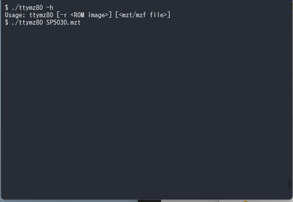

# ターミナル用 MZ-80K/C エミュレータ ttymz80

[ターミナル用PC-6001エミュレータ](http://000.la.coocan.jp/p6/basic.html#emu)を見て非常に面白いと思ったのと、ソースコード内のZ80エミュレーションコードが非常に使いやすかったので、MZ-80K/Cで同様のエミュレータを作ってみました。



## ビルド方法

src/ の中でmakeするだけです
(WSL2のUbuntu 20.04でしか確認していません)

## 使い方

```
Usage: ttymz80 [-r <ROM image>] [<mzt/mzf file>...]
```

* ROMイメージとして[MZ-NEW MONITOR](http://mzakd.cool.coocan.jp/mz-memories/mz700win.html##6)を内蔵していますが、SP-1002のROMイメージがある場合には `-r` オプションでファイル名を指定することでそれを使用します。
* テープのLOAD/SAVE処理に対応しました。コマンドラインに並べたmztまたはmzfファイルをLOADのたびに順番に使用していくため、BASICのプログラムをロードする場合は[BASIC本体] [BASICプログラム] の順に指定します。

## 未対応項目

* たくさん

## 謝辞

開発には以下のソースコードやデータ等を使用させていただきました。ありがとうございます。

* [ターミナル用PC-6001エミュレータ](http://000.la.coocan.jp/p6/basic.html#emu)内のZ80エミュレーションコード (z80.c, z80.h) を使用しています
* [MZ-NEW MONITOR](http://mzakd.cool.coocan.jp/mz-memories/mz700win.html##6)を使用許諾条件に基づいて使用しています
* MZ-80K/Cの仕様については[このページ](http://www43.tok2.com/home/cmpslv/Mz80k/EnrMzk.htm)の情報を参考にしています。
