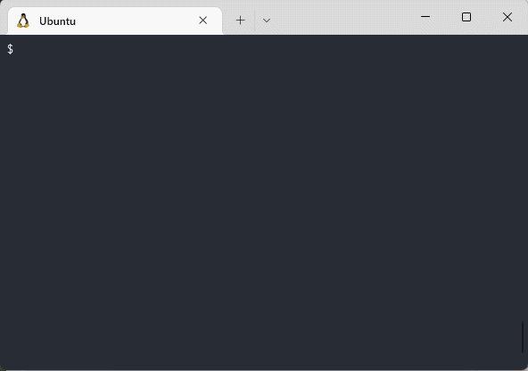
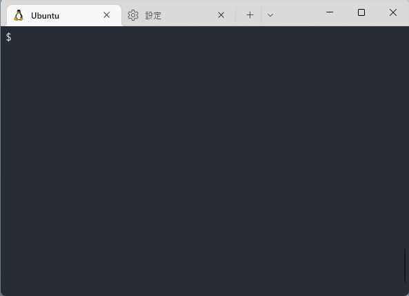
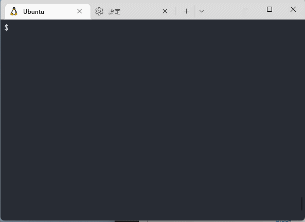
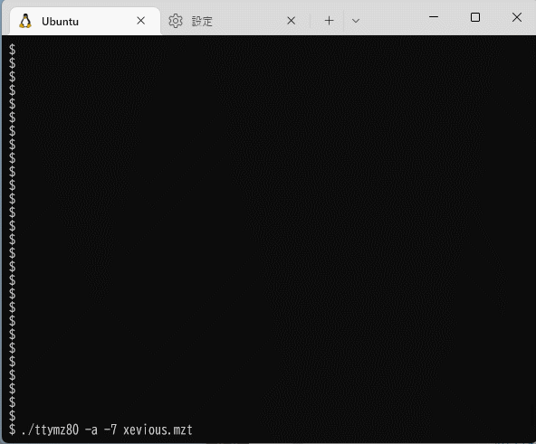
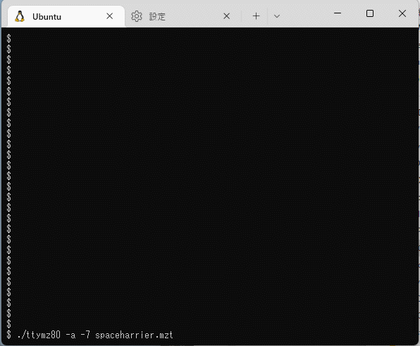

# ターミナル用 MZ-80K/C & MZ-700 エミュレータ ttymz80

[ターミナル用PC-6001エミュレータ](http://000.la.coocan.jp/p6/basic.html#emu)を見て非常に面白いと思ったのと、ソースコード内のZ80エミュレーションコードが非常に使いやすかったので、MZ-80K/Cで同様のエミュレータを作ってみました。

(追記) MZ-700のエミュレーションにも対応しました。



## ビルド方法

src/ の中でmakeするだけです
(WSL2のUbuntu 20.04とMSYS2での動作を確認しています)

## 使い方

```
Usage: ttymz80 [-a][-n][-w][-H][-7][-r <ROM image>][-c <cmd>][-C <cmdfile>] [<mzt/mzf file>...]
```

* `-a`
  * ROMモニタ起動後に "LOAD[CR]" を入力することで、コマンドラインのmzt/mzfファイルを自動起動します
* `-n`
  * 画面表示を抑制します
* `-w`
  * エミュレーションを実時間に合わせず最高速で実行します
* `-H`
  * 画面表示に全角文字の代わりに半角文字を使用します。グラフィック文字はほとんど表示されなくなります
* `-7`
  * MZ-700のエミュレーションを行います
* `-r <ROM image>`
  * ROMイメージとして[MZ-NEW MONITOR](http://mzakd.cool.coocan.jp/mz-memories/mz700win.html##6)を内蔵していますが、SP-1002のROMイメージがある場合にはこのオプションでファイル名を指定することで使用できます
  * `-7` オプションを指定した場合は、対応する1Z-009AのROMイメージを指定します
* `-c <cmd>`
  * エミュレータへの自動入力として与えるコマンド列を指定します
  * 英小文字は大文字に変換されます。改行を入力する場合は代わりに `|` を記述します
  * `{`～`}`で囲まれた文字列があると、後続の文字入力は画面にその文字列が表示されるまで待たされます
  * 例: ROMモニタからBASICを起動してプロンプトを待ち、コマンドを入力します
    * `ttymz80 SP5030.mzt -c 'load|{ready}10 print "hello world"|list|{ready}run|{ready}bye|'`
* `-C <cmdfile>`
  * `-c` オプションと同等の機能ですがコマンド列をコマンドラインからでなくファイルから読み込みます
* `<mzt/mzf file...>`
  * エミュレータのLOAD処理で使用するmzt/mzfファイルを並べます。最初のファイルがモニタからの"LOAD"コマンドで使用され、以降テープからのLOADを行うたびにファイルを順番に使用していきます。
  * このため、BASICを起動してプログラムをロードする場合は、[BASIC本体] [BASICプログラム] の順に指定します。

## キー配置

* 以下の特殊キーをサポートしています
  | キー           | MZ-80K/C           | MZ-700             |
  |----------------|--------------------|--------------------|
  | F1～F5         | ---                | F1～F5             |
  | Shift + F1～F5 | ---                | SHIFT + F1～F5     |
  | F6             | ---                | カナ               |
  | F7             | ---                | GRAPH              |
  | F8             | 英数               | 英数               |
  | Shift+F8       | SHIFT+英数 (カナ)  | ---                |
  | BackSpace      | DEL                | DEL                |
  | Insert         | SHIFT+DEL (INST)   | INST               |
  | Home           | HOME               | SHIFT+DEL (HOME)   |
  | End            | SHIFT+HOME (CLR)   | SHIFT+INST (CLR)   |
  | カーソル移動キー | カーソル移動     | カーソル移動       |
  | Pause          | SHIFT+BREAK        | SHIFT+BREAK        |
  | Tab            | SHIFT単独押し      | SHIFT単独押し      |
  | Esc            | ---                | CTRL単独押し       |
  | Ctrl+C         | エミュレータの終了 | エミュレータの終了 | 
  | Ctrl+A         | デバッグ表示ON/OFF | デバッグ表示ON/OFF |
  | Ctrl+W         | ノーウェイトON/OFF | ノーウェイトON/OFF |

## 制約

* MZ-80/700固有のグラフィックキャラクタは、Unicode収録文字を使ってそれらしいものに置き換えて表示していますが、ターミナルや使用するフォントによって表示が崩れたりする場合があります
* サウンドは未サポートです。ただ、ビープ音を鳴らすROMルーチン(アドレス$003E)を実行したときにターミナルのビープ音が鳴ります
* キー入力は、ターミナルへ入力された文字から対応するキーのスキャンコードへの変換を行うことによって実現しています。このため様々な制約があります
  * 複数キーの同時押しの認識はできません
  * SHIFTキー単独など、ターミナルへの入力を発生させないキーは認識できません
  * SHIFTを伴う文字入力、例えば　"!" は SHIFT押す→SHIFT+1押す→離す といった入力シーケンスを発生させることで再現しています。ROMモニタやBASICなどでうまく動作することは確認しましたが、アプリケーションによっては正常に認識できないかも知れません
  * キーを「押した」「離した」といったイベント単位での認識ができないため、アクションゲームなどでの移動は移動キーを連打するかキーのオートリピートに頼る必要があります
  * カナ入力やグラフィック文字入力など未対応のキー入力がたくさんあります
* `-c`, `-C`コマンドでの文字列表示待ちは単純に「VRAMに指定された文字列が連続で書き込まれたか」で判断しているため、例えば画面スクロールなどVRAMに再描画が発生する場合などに誤認識の可能性があります
* 他にも細かい未対応機能や不完全な実装が残っています

## スクリーンショット

ネットでダウンロード可能なMZ-80/700用ゲームを動かしてみます。
公開していただいている皆様に感謝します。

### Wonder House
* 1983年 タスクフォース高知から発売されていたアドベンチャーゲームです
* [MZ700WIN関連ファイル再配布所](http://mzakd.cool.coocan.jp/mz-memories/mz700win.html) からダウンロードできます


### ZELBUS
* 鈴木康之氏作 PiO 1985年11月号掲載
* [ZEPLISシリーズ ダウンロードページ](http://www.maroon.dti.ne.jp/youkan/mz700/zeplis/) からダウンロードできます


### Tiny XEVIOUS
* 古旗一浩氏作 Oh!MZ 1986年11月号掲載
* [OpenSpace download page](http://www.openspc2.org/download/) で公開されている "MZ-700 Games" をダウンロードして、xevious.bin を
[MZ700WIN関連ファイル再配布所](http://mzakd.cool.coocan.jp/mz-memories/mz700win.html) にある「古旗一浩氏が公開されている700用バイナリデータをmz700win用に変換するツール」(FURUCONV.EXE) で MZT形式に変換することで使用できます


### SPACE HARRIER
* 古旗一浩氏作 Oh!MZ 1988年10月号掲載
* [OpenSpace download page](http://www.openspc2.org/download/) で公開されている "MZ-700 Games" をダウンロードして、spaceharrier.bin を
[MZ700WIN関連ファイル再配布所](http://mzakd.cool.coocan.jp/mz-memories/mz700win.html) にある「古旗一浩氏が公開されている700用バイナリデータをmz700win用に変換するツール」(FURUCONV.EXE) で MZT形式に変換することで使用できます
* ターミナルへ高頻度で文字出力が発生するアプリのため、使用するターミナルやフォントによっては動作がぎくしゃくすることがあります
  * Windows Terminal + BIZ UDゴシック で確認
  * フォントをMSゴシックにすることで改善できます



## 謝辞

開発には以下のソースコードやデータ等を使用させていただきました。ありがとうございます。

* [ターミナル用PC-6001エミュレータ](http://000.la.coocan.jp/p6/basic.html#emu)内のZ80エミュレーションコード (z80.c, z80.h) を使用しています
* [MZ-NEW MONITOR](http://mzakd.cool.coocan.jp/mz-memories/mz700win.html##6)を使用許諾条件に基づいて使用しています
* MZ-80K/Cの仕様については[このページ](http://www43.tok2.com/home/cmpslv/Mz80k/EnrMzk.htm)の情報を参考にしています
* MZ-700の仕様については[このページ](http://www.maroon.dti.ne.jp/youkan/mz700/mzioframe.html)の情報を参考にしています


## ライセンス

ttymz80に含まれるファイルのうち、以下のものはそれぞれの配布元のライセンス条件に従います。

- src/z80.c
- src/z80.h
  - 2条項BSDライセンス ([COPYING.z80](COPYING.z80))
- src/mz_newmon/*
  - 「当イメージの再配布・複製・Ｗｅｂサイトへの転載は、営利を目的としない限り自由です」　([src/mz_newmon/newmon_readme.txt](src/mz_newmon/newmon_readme.txt))

上記以外のすべてのファイルは2条項BSDライセンスとします。([COPYING](COPYING))
